<p align="center">
  <picture>
    <source media="(prefers-color-scheme: dark)" srcset="docs/images/graphein-logo-horizontal-dark.svg">
    
  </picture>
</p>

<p align="center">A beautiful, high-performance, <strong>agent-first</strong> data visualization library.</p>

# Graphein

Graphein is a from-scratch (zero runtime dependency) visualization toolkit designed so that
**coding agents** can assemble stunning dashboards and reports from declarative,
JSON-serializable chart specs. Think Tableau-class visuals with a tiny, fast, hybrid
Canvas2D + DOM rendering core.

- **One chart = one JSON object.** No callbacks, no DOM wrangling — just a `ChartSpec`.
- **Stunning by default.** Flat, modern light/dark themes, an accessible palette, and
  perceptual (OKLab) color scales.
- **Hand-drawn mode.** Flip on `sketch: true` for a rough.js-style sketched look —
  wobbly strokes, hachure fills, and a handwriting font — on any chart type.
- **Fast at scale.** LTTB decimation, layered redraw, and virtualized tables keep things
  smooth from a handful of points to 50k+.
- **From scratch.** Scales, ticks, color, shapes, the pivot engine, the sketch
  renderer, and the core renderer are all hand-written — no D3/charting dependencies.
- **Self-correcting.** `validateSpec` returns structured, path-pointed errors *with
  JSON-patch fixes* and best-practice lint warnings; after render, `chart.report()` flags
  clipping, overflow, and contrast issues — so an agent can validate, repair, and critique
  a chart **without a vision model**. Run the whole loop server-side with
  [`@graphein/node`](./packages/node).
- **Declarative data shaping.** In-spec `transform`s (aggregate, bin, filter, fold,
  timeUnit, calculate) mean you never pre-pivot the `data` array by hand.

## Gallery

A quick tour of what Graphein renders — **every image below is a single declarative `ChartSpec`.**
Explore them live, resize them, and tweak the JSON in the Playground with `npm run gallery`.

<table>
  <tr>
    <td width="50%">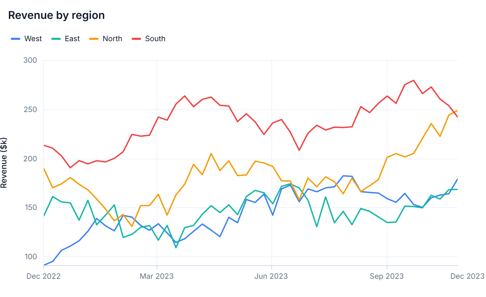<br><sub><b>line</b> — multi-series with legend</sub></td>
    <td width="50%">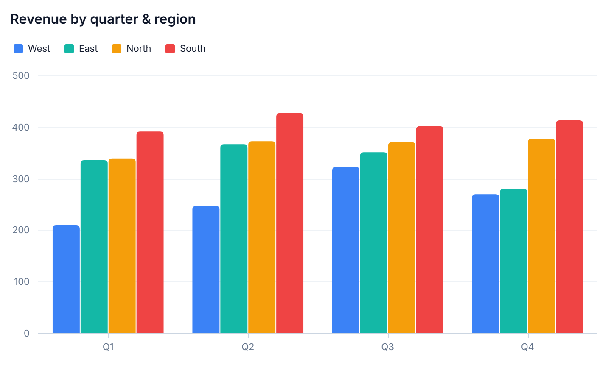<br><sub><b>bar</b> — grouped categories</sub></td>
  </tr>
  <tr>
    <td>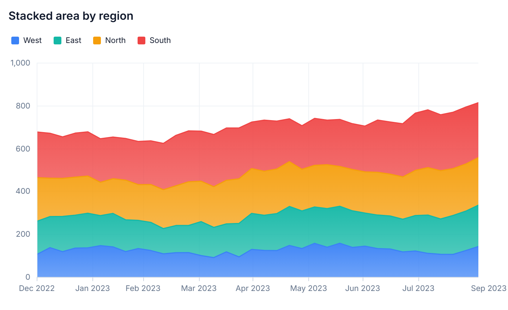<br><sub><b>area</b> — stacked over time</sub></td>
    <td>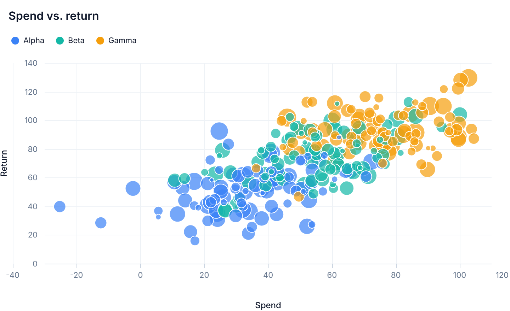<br><sub><b>scatter</b> — bubble size + color groups</sub></td>
  </tr>
  <tr>
    <td>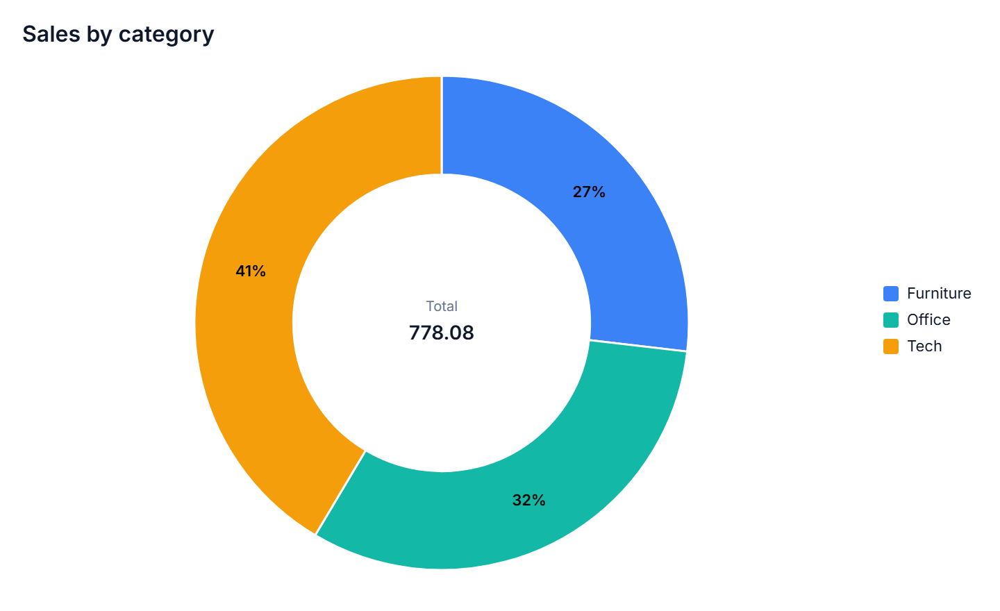<br><sub><b>pie</b> — donut with labels</sub></td>
    <td>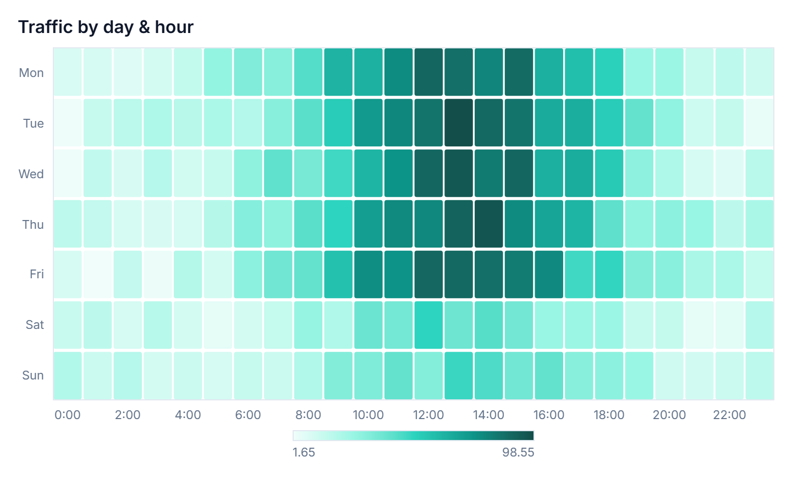<br><sub><b>heatmap</b> — week × hour density</sub></td>
  </tr>
  <tr>
    <td>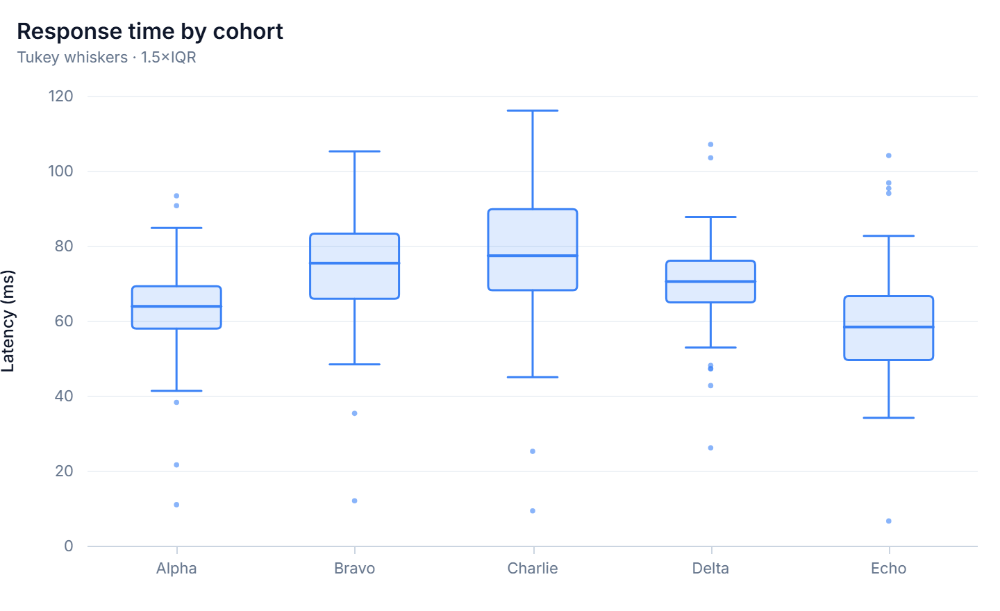<br><sub><b>box</b> — distribution by group</sub></td>
    <td>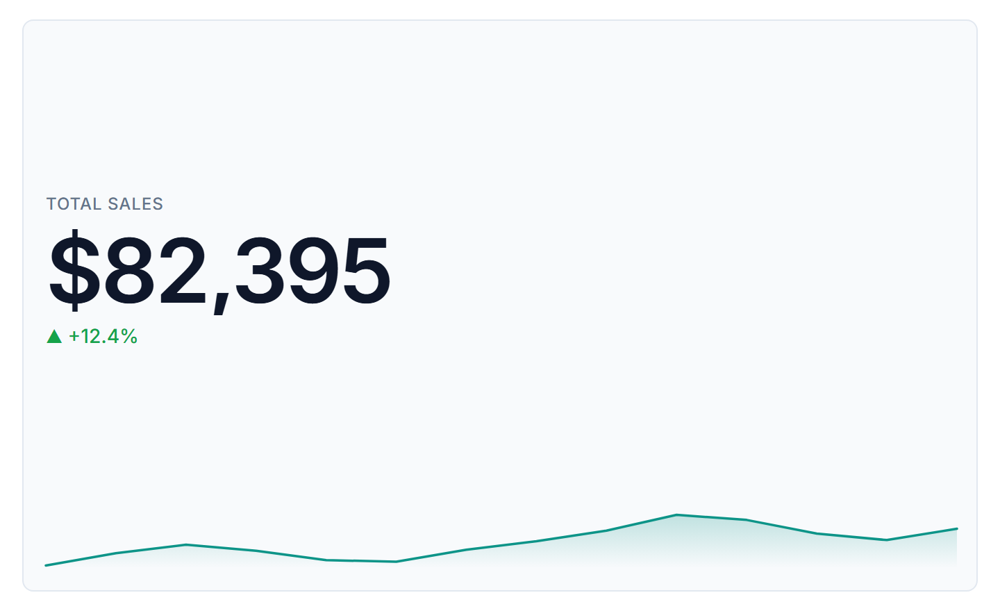<br><sub><b>kpi</b> — metric, delta + sparkline</sub></td>
  </tr>
</table>

<table>
  <tr><td>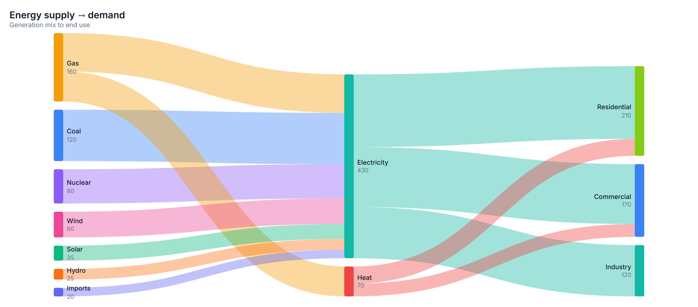<br><sub><b>sankey</b> — weighted flows from <code>source → target</code></sub></td></tr>
  <tr><td>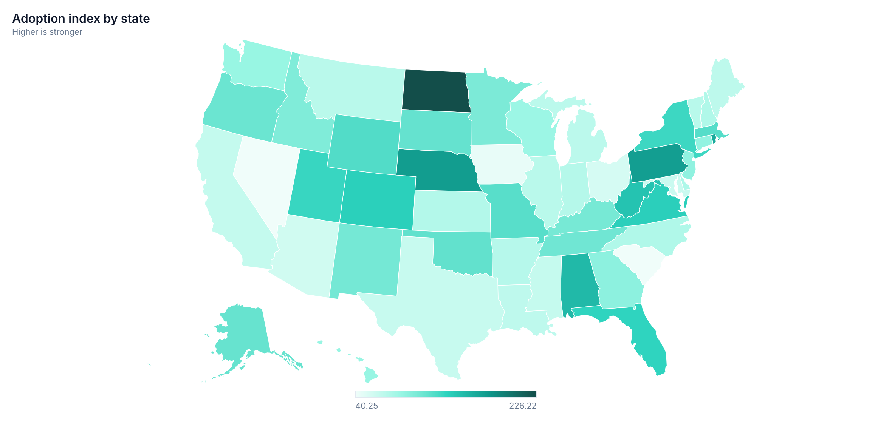<br><sub><b>choropleth</b> — values shaded over GeoJSON regions</sub></td></tr>
  <tr><td>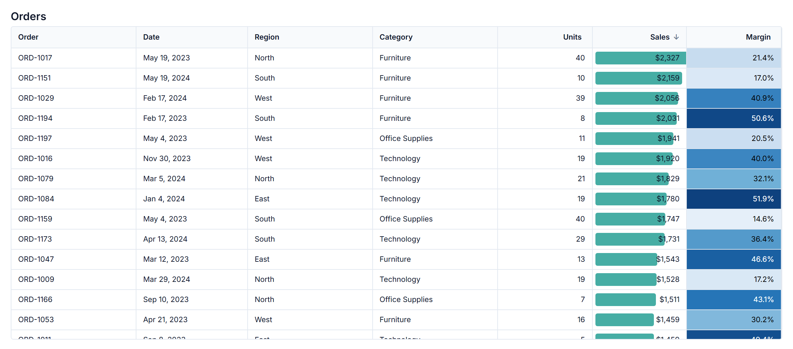<br><sub><b>table</b> — virtualized, sortable, with bar + color-scale conditional formatting</sub></td></tr>
  <tr><td>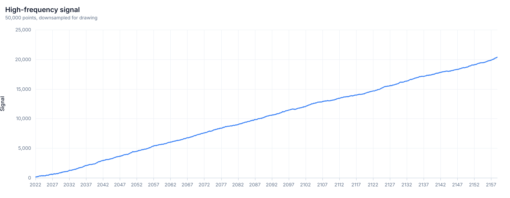<br><sub><b>line</b> — 50,000 points, LTTB-downsampled, still smooth</sub></td></tr>
</table>

### One spec, three looks

The same `box` chart in light, dark, and hand-drawn (`"sketch": true`) modes — just flip a field:

<table>
  <tr>
    <td width="33%">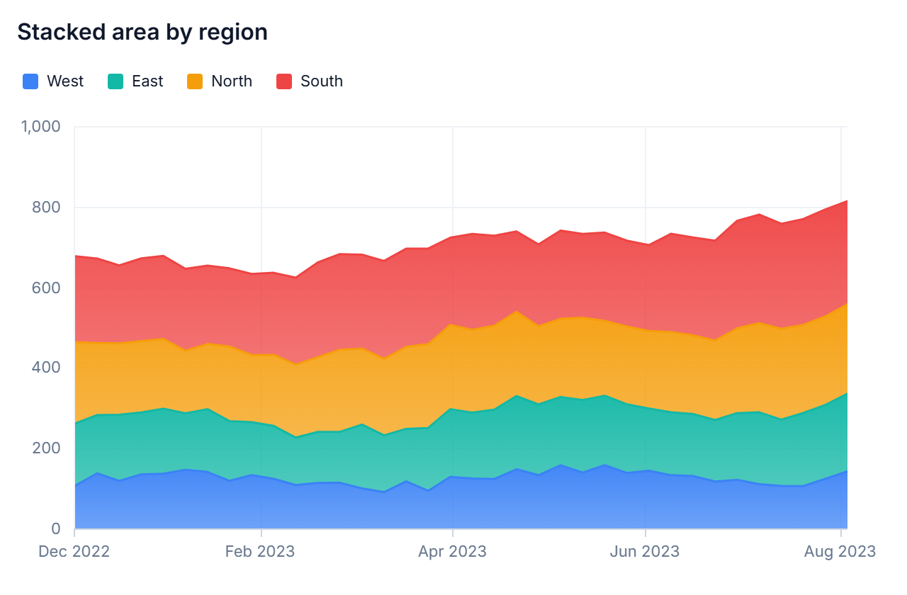<br><sub>Light</sub></td>
    <td width="33%">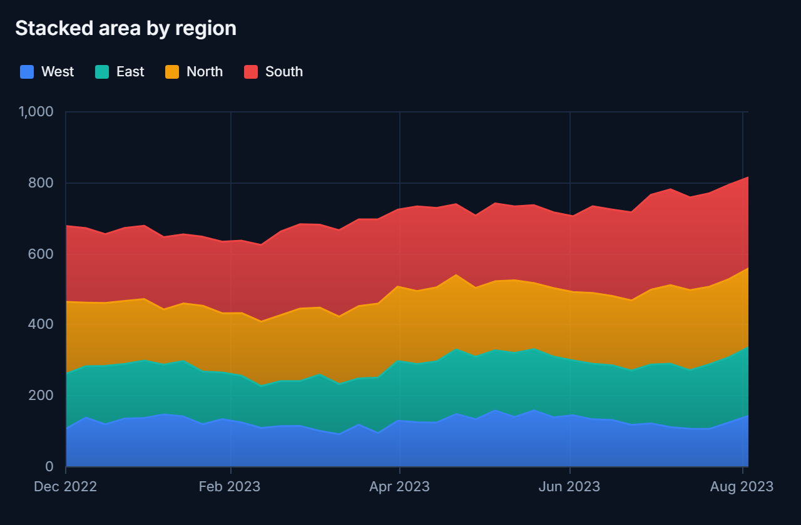<br><sub>Dark</sub></td>
    <td width="33%">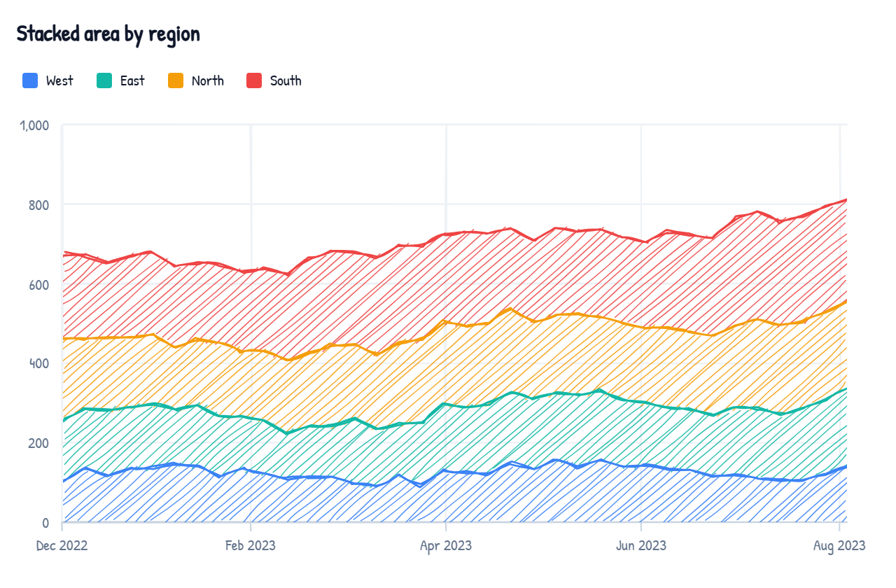<br><sub>Sketch</sub></td>
  </tr>
</table>

## Install

```bash
# the zero-dependency core engine
npm install graphein
```

```ts
import { render, validateSpec } from 'graphein';
```

Using React? Install the wrapper alongside `react`:

```bash
npm install @graphein/react react
```

```tsx
import { Chart } from '@graphein/react';
```

Rendering on a server (CI, agents, report jobs)? Render straight to a PNG — no browser:

```bash
npm install @graphein/node graphein
```

```ts
import { renderChart } from '@graphein/node';
const { png, report } = renderChart(spec, { width: 900, height: 480, dpr: 2 });
```

## Quick start

```ts
import { render } from 'graphein';

const chart = render('#app', {
  type: 'line',
  title: 'Monthly active users',
  data: [
    { month: '2024-01', users: 4200 },
    { month: '2024-02', users: 4650 },
    { month: '2024-03', users: 5010 },
    { month: '2024-04', users: 4880 },
    { month: '2024-05', users: 5430 },
    { month: '2024-06', users: 6120 },
  ],
  encoding: {
    x: { field: 'month', type: 'temporal' },
    y: { field: 'users', type: 'quantitative', format: ',d' },
  },
});

// later…
chart.update(nextSpec);  // new data/config
chart.resize();          // re-measure after a layout change
chart.destroy();         // tear down
```

### React

```tsx
import { Chart } from '@graphein/react';

function Dashboard({ spec }) {
  return (
    <div style={{ height: 360 }}>
      <Chart spec={spec} />
    </div>
  );
}
```

`<Chart spec={…} />` renders into a fill-by-default container; pass a new `spec`
to update in place, and it tears down on unmount. For headless control over your
own element, use the `useChart(spec)` hook (returns a ref to attach). `react` is a
peer dependency (React 18+).

## The agent feedback loop

Graphein's real edge isn't the charts — it's that a model never trained on its API can
still get them right, because the library is **self-validating, self-repairing, and
self-critiquing** at runtime.

```ts
import { validateSpec, repairSpec, render } from 'graphein';

// 1. Validate — structured, path-pointed errors plus best-practice lint warnings.
const { valid, errors, warnings } = validateSpec(spec);

// 2. Repair — apply the safe JSON-patch fixes Graphein suggests, instead of regenerating.
const { spec: fixed, applied, remaining } = repairSpec(spec);

// 3. Render, then critique — no vision model needed.
const chart = render('#app', fixed);
const report = chart.report();
if (!report.ok) {
  // report.diagnostics → 'axis-label-overlap', 'legend-overflow', 'low-contrast-mark', …
}
```

- **Self-repairing validation.** Each `validateSpec` error can carry a `fix` (RFC-6902
  JSON Patch) and a "did you mean" `suggestion`, turning a mistake into a one-step
  correction; `repairSpec` applies the safe ones for you.
- **Built-in dataviz linter.** Best-practice warnings (too many pie slices, a temporal
  field typed nominal, dual-axis misuse, too many colors) bake in expertise the agent lacks.
- **Declarative transforms.** Shape data *inside* the validatable spec — `aggregate`,
  `bin`, `filter`, `fold`, `timeUnit`, and a safe `calculate` expression engine.
- **Reference annotations.** Reusable `annotations` (lines, bands, threshold zones) on
  every cartesian chart.
- **Render report.** `chart.report()` returns machine-readable diagnostics — clipped
  labels, legend overflow, contrast failures, mark counts — to verify a chart came out right.
- **Headless rendering.** [`@graphein/node`](./packages/node) runs that whole loop
  server-side to a PNG (no browser, no JSDOM), so an agent can generate → validate →
  repair → render → critique entirely in CI or a report job.

See the **[Agent Guide](./docs/agent-guide.md)** for the full playbook.

## Chart catalog

| Type | What it's for | Example |
| --- | --- | --- |
| `line` | Trends over time; multi-series, curves, markers, area fill | [line.json](./docs/examples/line.json) |
| `area` | Volume/part-to-whole over time; stacking | [area-stacked.json](./docs/examples/area-stacked.json) |
| `bar` | Compare categories; grouped or stacked series | [bar-grouped.json](./docs/examples/bar-grouped.json) |
| `combo` | Two measures / different units: bar + line on a shared `x`, dual axes | [combo-dual-axis.json](./docs/examples/combo-dual-axis.json) |
| `scatter` | Correlation/distribution; bubble size + color groups | [scatter.json](./docs/examples/scatter.json) |
| `histogram` | Distribution of one measure; auto-binned bars + optional density | [histogram.json](./docs/examples/histogram.json) |
| `pie` | Composition as shares; pie or donut | [pie-donut.json](./docs/examples/pie-donut.json) |
| `heatmap` | Density across two categories | [heatmap.json](./docs/examples/heatmap.json) |
| `funnel` | Conversion through ordered stages | [funnel.json](./docs/examples/funnel.json) |
| `kpi` | Headline metric with delta + sparkline | [kpi.json](./docs/examples/kpi.json) |
| `table` | Virtualized, sortable data table + conditional formatting | [table.json](./docs/examples/table.json) |
| `matrix` | Pivot/cross-tab: groups, aggregates, subtotals/grand totals | [matrix.json](./docs/examples/matrix.json) |
| `box` | Distributions by category; Tukey/min-max whiskers + outliers | [box.json](./docs/examples/box.json) |
| `sankey` | Flows between nodes from `source → target` link rows | [sankey.json](./docs/examples/sankey.json) |
| `choropleth` | Values shaded over GeoJSON regions; sequential color scale | [choropleth.json](./docs/examples/choropleth.json) |
| `treemap` | Hierarchical part-to-whole as squarified nested tiles | [treemap.json](./docs/examples/treemap.json) |
| `gauge` | A single value against a scale, with bands + target | [gauge.json](./docs/examples/gauge.json) |
| `bullet` | Compact KPI-vs-target bar over qualitative ranges | [bullet.json](./docs/examples/bullet.json) |
| `calendarHeatmap` | Daily values as a GitHub-style year grid | [calendar-heatmap.json](./docs/examples/calendar-heatmap.json) |
| `waterfall` | Running-total bridge built from signed step deltas | [waterfall.json](./docs/examples/waterfall.json) |
| `slope` | Before/after slope graph with direct end labels | [slope.json](./docs/examples/slope.json) |
| `dumbbell` | Gap between two groups per category as connected dots | [dumbbell.json](./docs/examples/dumbbell.json) |

Every cartesian chart also takes `transform`s (in-spec data shaping) and `annotations`
(reference lines, bands, threshold zones).

Add `"sketch": true` to **any** spec for a hand-drawn look — see
[bar-sketch.json](./docs/examples/bar-sketch.json) and the
[`SketchConfig` reference](./docs/spec-reference.md#sketchconfig).

## Documentation

- **[Agent Guide](./docs/agent-guide.md)** — the playbook for generating charts &
  dashboards: data shaping, chart selection, recipes, and gotchas.
- **[Spec Reference](./docs/spec-reference.md)** — every field of every chart type,
  encoding channels, scales, themes, and the format mini-language.
- **[JSON Schema](./docs/chart-spec.schema.json)** — machine-readable `ChartSpec` schema
  for validation and editor autocomplete.
- **[Examples](./docs/examples)** — a runnable JSON spec for every chart type.

## How it works

- **Hybrid rendering** — Canvas2D draws data marks and gridlines; an absolutely
  positioned HTML/SVG overlay handles crisp text (axis labels, legend, titles, tooltips,
  KPI cards) and accessibility.
- **Declarative spec → scales → marks** — a Vega-Lite-flavored encoding maps data
  columns onto visual channels. A layout engine reserves space for axes/legend/title,
  then charts draw into the plot rect. Hi-DPI aware, single batched redraw.
- **Interaction** — hover tooltips, crosshair, focus highlight, and slice/cell emphasis
  paint on a separate interaction canvas, so hovering never triggers a full mark redraw.
- **Ready signal** — when a render settles, Graphein sets `data-graphein-ready="true"` on the
  surface root and increments `window.__GRAPHEIN_READY`, so automation can wait
  deterministically.
- **Headless & self-critiquing** — the same model build and mark renderers run in Node via
  [`@graphein/node`](./packages/node) (backed by `@napi-rs/canvas`), painting overlay text
  onto the canvas to emit a PNG plus a `RenderReport` — so the validate → render → critique
  loop runs with no browser. Core's `renderToContext(target, spec)` paints onto any 2D
  context if you bring your own canvas.

## Packages

| Package | Description | Status |
| --- | --- | --- |
| `graphein` | Framework-agnostic engine, scales, charts, tables (zero deps). | ✅ |
| `@graphein/react` | Thin React wrapper: `<Chart spec={...} />`. | ✅ |
| `@graphein/node` | Headless rendering: `ChartSpec` → PNG + `RenderReport`, no browser. | ✅ |
| `apps/gallery` | Vite gallery + screenshot harness for visual iteration. | ✅ (dev) |

## Development

This is a monorepo managed with npm workspaces.

```bash
npm install
npm run build       # build all packages
npm test            # run unit tests (Vitest)
npm run typecheck   # type-check all workspaces
npm run gallery     # launch the Vite gallery harness for visual iteration
```

The **gallery** opens on an **Overview** — a mosaic of every chart type, each one a single
`ChartSpec`, with global light/dark and hand-drawn **sketch** toggles. Pick any chart to see
it large alongside its spec and a responsive size strip; a Playwright screenshot runner
captures the matrix so visual quality is verified by review, not assumed. It also ships a
**Playground** (`npm run gallery`, then pick *Playground* in the sidebar) where you can edit a
`ChartSpec` live, seed it from presets spanning every chart type and data size, drag to resize
the canvas, and shuffle the data to watch the update transitions.

## Design references

Built fresh, with lessons borrowed from the best of open source: **D3** (scale/tick math,
shape generation), **Vega-Lite** (declarative encoding grammar), **uPlot/ECharts/Chart.js**
(canvas performance, layered redraw), **Observable Plot** (sensible-defaults API),
**LTTB** (series decimation), and **OKLab/OKLCH** (perceptual color).

## Brand

The Graphein mark is a lowercase **"g"** whose nodes trace a sequential color ramp —
indigo → blue → cyan → emerald — the same kind of perceptual scale the library ships for
data. Logo lockups, icon variants, and favicon-ready marks live in
[`docs/images`](docs/images).

<p align="center">
  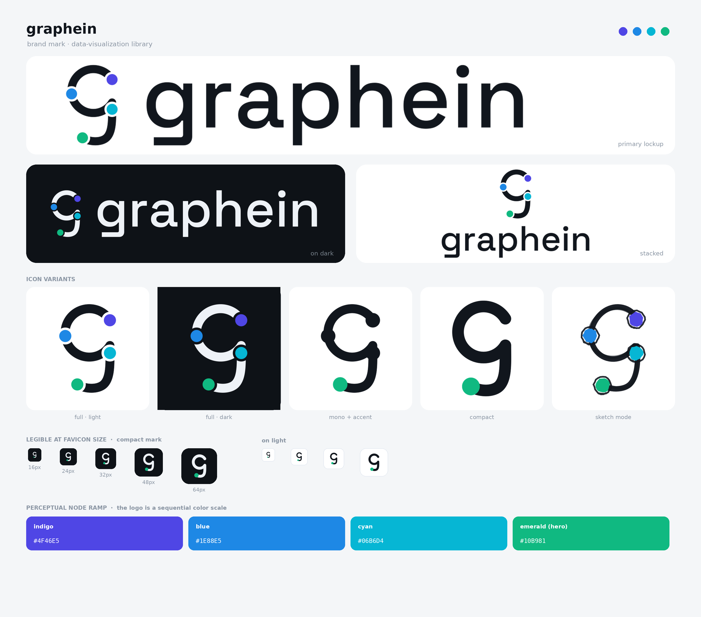
</p>
