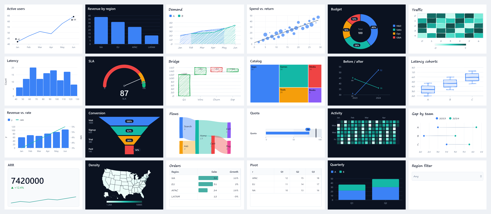

<p align="center">
  <picture>
    <source media="(prefers-color-scheme: dark)" srcset="docs/images/graphein-logo-horizontal-dark.svg">
    
  </picture>
</p>

<p align="center"><strong>Agent-first</strong> data visualization from JSON-serializable chart specs.</p>

# Graphein

Graphein is a zero-runtime-dependency TypeScript visualization engine. The one rule is: emit one JSON-serializable `ChartSpec` with a `type`, a flat `data` array, and, for cartesian charts, an `encoding` that maps fields to channels.

That shape is meant for generated code and ordinary application code alike. Specs contain data, marks, encodings, transforms, selections, layout, and formatting, but not callbacks. You can validate a spec before rendering with `validateSpec(spec)`, apply safe JSON Patch repairs with `repairSpec(spec)`, render it with `render(container, spec)`, and inspect the result with `chart.report()`.

The core package includes the chart model, scales, ticks, colors, transforms, layout, Canvas2D mark rendering, DOM/SVG overlays, tables, matrix pivots, slicers, and dashboards. It ships without runtime dependencies. Native rendering lives in `@graphein/node`; React support lives in `@graphein/react`; MCP integration lives in `graphein-mcp`.

## Gallery

**[Live gallery → spatney.github.io/graphein](https://spatney.github.io/graphein/)** — every chart family, plus a Playground to edit a spec live (validate → repair → render → report). Run `npm run gallery` to open it locally.

Twenty-four specs below — every chart type plus KPI cards, tables, pivot matrices, and a slicer — each a single JSON `ChartSpec`, shown across light, dark, and hand-drawn sketch. All render headless: this image is generated by `@graphein/node`, not a browser.



Same spec, three looks: set `"theme": "dark"` or `"sketch": true` to switch.

## Install

```bash
npm install graphein
```

```ts
import { render, validateSpec } from 'graphein';
```

For React, install the wrapper alongside React:

```bash
npm install @graphein/react react
```

```tsx
import { Chart } from '@graphein/react';
```

For headless PNG output in Node:

```bash
npm install @graphein/node graphein
```

```ts
import { renderChart } from '@graphein/node';

const { png, report } = renderChart(spec, { width: 900, height: 480, dpr: 2 });
```

For MCP clients:

```jsonc
{
  "mcpServers": {
    "graphein": { "command": "npx", "args": ["-y", "graphein-mcp"] }
  }
}
```

`graphein-mcp` exposes four tools: `render_chart`, `validate_chart`, `repair_chart`, and `summarize_chart`. It also serves the agent guide, JSON Schema, and spec reference as MCP resources.

## Quick start

```ts
import { render, validateSpec } from 'graphein';
import type { ChartSpec } from 'graphein';

const spec: ChartSpec = {
  type: 'line',
  title: 'Monthly active users',
  data: [
    { month: '2024-01', users: 4200 },
    { month: '2024-02', users: 4650 },
    { month: '2024-03', users: 5010 },
    { month: '2024-04', users: 4880 },
    { month: '2024-05', users: 5430 },
    { month: '2024-06', users: 6120 },
  ],
  encoding: {
    x: { field: 'month', type: 'temporal' },
    y: { field: 'users', type: 'quantitative', format: ',d' },
  },
};

const result = validateSpec(spec);
if (result.valid === false) throw new Error(result.errors[0]?.message ?? 'Invalid chart spec');

const chart = render('#app', spec);

chart.update({ ...spec, title: 'Monthly active users, H1' });
chart.resize();
chart.destroy();
```

### React

```tsx
import { Chart } from '@graphein/react';

export function UsageChart({ spec }) {
  return (
    <div style={{ height: 360 }}>
      <Chart spec={spec} />
    </div>
  );
}
```

`<Chart spec={...} />` fills its container, updates when `spec` changes, and tears down on unmount. `useChart(spec)` is available when you want to attach Graphein to your own element. React is a peer dependency.

## The spec loop

A generated spec should go through the same path as a handwritten one:

1. Build tidy row-oriented data.
2. Pick a `type` and map fields through `encoding`, or use the fields required by the non-cartesian spec.
3. Call `validateSpec(spec)`. If errors include safe fixes, call `repairSpec(spec)` and validate again.
4. Render with `render(container, spec)` or `<Chart spec={spec} />`.
5. Use `chart.report()` to check mark counts, clipped labels, legend overflow, contrast diagnostics, and the generated summary.

```ts
import { repairSpec, render, validateSpec } from 'graphein';

const firstPass = validateSpec(spec);
const fixed = firstPass.valid ? spec : repairSpec(spec).spec;
const secondPass = validateSpec(fixed);

if (secondPass.valid === false) {
  throw new Error(secondPass.errors.map((error) => error.message).join('\n'));
}

const chart = render('#app', fixed);
const report = chart.report();
```

`validateSpec` reports structural errors with paths and, when the correction is unambiguous, RFC 6902 JSON Patch fixes. `repairSpec` applies the safe fixes. `chart.report()` is computed from the resolved render model, so agents and tests can detect common render issues without image inspection.

`summarize(spec)` returns a deterministic natural-language description and is also surfaced through `chart.report().summary` and the chart `aria-description`. Set `insights: true` on `line`, `area`, or `bar` to label the max and min. Set `trendline: true` on `scatter`, `line`, or `area` to derive a linear fit; `{ label: true }` adds an R² label. Set `facet: { field }` on `line`, `area`, `bar`, or `scatter` for small multiples with shared scales.

## Chart types

| Type | Use | Key fields |
| --- | --- | --- |
| `line` | Trends over time or another ordered x field | `encoding.x`, `encoding.y`, optional `series` |
| `area` | Filled trends and stacked part-to-whole over time | `encoding.x`, `encoding.y`, optional `series`, `stack` |
| `bar` | Category comparisons | `encoding.x`, `encoding.y`, optional `series`, `stack`, `group` |
| `combo` | Multiple cartesian layers on shared x, including bar plus line | `encoding.x`, `layers[]` |
| `scatter` | Relationship between two measures | `encoding.x`, `encoding.y`, optional `size`, `color` |
| `histogram` | Distribution of one quantitative field | `encoding.x`, optional `bin`, `density` |
| `pie` | Shares of a total, with optional donut mode | `encoding.theta`, `encoding.color`, optional `donut` |
| `heatmap` | Density or magnitude across two categories | `encoding.x`, `encoding.y`, `encoding.color` |
| `box` | Distribution by group | `encoding.x`, `encoding.y`, optional `series` |
| `funnel` | Ordered conversion stages | `encoding.stage`, `encoding.value` |
| `sankey` | Weighted flows between nodes | `encoding.source`, `encoding.target`, `encoding.value` |
| `choropleth` | Values joined to GeoJSON features | `geo`, `encoding.key`, `encoding.color`, optional `featureId` |
| `treemap` | Hierarchical part-to-whole | `encoding.category`, `encoding.value`, optional `group`, `color` |
| `gauge` | Single value against a bounded scale | `value`, `max`, optional `target`, `bands` |
| `bullet` | Compact value versus target | `value`, optional `target`, `ranges` |
| `calendarHeatmap` | Daily values over a year-style grid | `encoding.date`, `encoding.color` |
| `waterfall` | Running total from signed deltas | `encoding.stage`, `encoding.value`, optional `showTotal` |
| `slope` | Before/after or ordered change by series | `encoding.x`, `encoding.y`, `encoding.series` |
| `dumbbell` | Gap between groups per category | `encoding.category`, `encoding.value`, `encoding.group` |
| `kpi` | Headline metric with optional delta and sparkline | `value`, optional `delta`, `sparkline` |
| `table` | Tabular detail with sorting, totals, and conditional formatting | `columns` |
| `matrix` | Pivot or cross-tab with aggregates | `rows`, `columns`, `values` |

Examples live in [`docs/examples`](./docs/examples). The field-by-field contract is in [`docs/spec-reference.md`](./docs/spec-reference.md), and the generated JSON Schema is in [`docs/chart-spec.schema.json`](./docs/chart-spec.schema.json).

## Dashboards and slicers

A `dashboard` spec composes views on a grid and shares a selection store across them. Views may use their own data or inherit dashboard data. With `interactions: 'auto'`, slicers filter compatible views, and chart selections cross-highlight charts that share fields.

The five slicer visual types are `dropdown`, `list`, `search`, `range`, and `dateRange`. Each reads a `field` and publishes a named `param`; consumers use `filter: [{ param }]` or `highlight: { param }`.

```ts
import { renderDashboard, validateSpec } from 'graphein';
import type { DashboardSpec } from 'graphein';

const dashboard: DashboardSpec = {
  type: 'dashboard',
  data: rows,
  views: [
    {
      id: 'region',
      title: 'Region',
      spec: { type: 'dropdown', field: 'region', multiple: true },
      w: 3,
      h: 2,
    },
    {
      id: 'sales',
      title: 'Sales',
      spec: {
        type: 'bar',
        encoding: { x: { field: 'region' }, y: { field: 'sales' } },
        filter: [{ param: 'region' }],
      },
      w: 9,
      h: 4,
    },
  ],
  interactions: 'auto',
};

validateSpec(dashboard);
const instance = renderDashboard('#app', dashboard);
instance.setSelection({ region: ['West'] });
```

Dashboard layout supports sectioned layouts, per-view titles and subtitles, card padding, backgrounds, responsive spans, and presets such as `auto`, `kpi-first`, and `sidebar`.

## Rendering and accessibility details

Graphein uses Canvas2D for data marks and gridlines, with an HTML/SVG overlay for text, legends, titles, tooltips, KPI cards, and accessibility attributes. Interaction state paints on a separate canvas so hover does not require a full redraw. When rendering settles, the root gets `data-graphein-ready="true"` and `window.__GRAPHEIN_READY` increments for automation.

`@graphein/node` renders canvas-backed charts to PNG with `@napi-rs/canvas` and returns the same `RenderReport` shape as the browser API. It renders every chart type — line, area, bar, scatter, box, pie, heatmap, sankey, choropleth, combo, histogram, funnel, treemap, gauge, bullet, calendarHeatmap, waterfall, slope, dumbbell, plus the formerly DOM-only `kpi`, `table`, `matrix`, slicers, and dashboards, which paint to a static canvas headlessly.

Sketch mode is part of the spec. Set `sketch: true` for default hand-drawn strokes, hachure fills, and font handling, or pass `SketchConfig` to tune roughness, bowing, fill style, stroke width, and seed.

## Documentation

- [Agent Guide](./docs/agent-guide.md): workflow, chart selection, repair loop, dashboards, and recipes for generated specs.
- [Spec Reference](./docs/spec-reference.md): fields for every chart, table, matrix, slicer, dashboard, transform, annotation, and theme option.
- [JSON Schema](./docs/chart-spec.schema.json): generated schema for `ChartSpec` and `DashboardSpec`.
- [Examples](./docs/examples): runnable JSON specs.

## Packages

| Package | Purpose |
| --- | --- |
| [`graphein`](./packages/core) | Framework-agnostic core engine, validators, renderers, transforms, tables, matrices, slicers, and dashboards. |
| [`@graphein/react`](./packages/react) | React wrapper with `<Chart spec={...} />` and `useChart(spec)`. |
| [`@graphein/node`](./packages/node) | Headless PNG rendering for canvas-backed charts. |
| [`graphein-mcp`](./packages/mcp) | MCP server with `render_chart`, `validate_chart`, `repair_chart`, and `summarize_chart`. |
| [`apps/gallery`](./apps/gallery) | Vite gallery, Playground, and screenshot harness for development. |
| [`tests/visual`](./tests/visual) | Playwright visual tests. |

## Development

This repository uses npm workspaces.

```bash
npm install
npm run build
npm test
npm run typecheck
npm run lint
npm run gallery
```

The core package is intended to remain dependency-free at runtime. After changing TypeScript spec types, run `npm run gen:schema` and commit the generated `docs/chart-spec.schema.json`. After changing docs that are bundled into the MCP package, run `npm run sync:resources --workspace graphein-mcp`. Regenerate the README montage with `node tests/visual/readme-montage.mjs`.

## License

MIT


